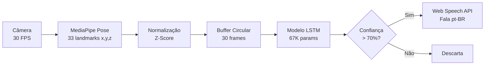

# 🤟 Tradutor de Libras para Áudio

<p align="center">
  <strong>Sistema de IA que traduz sinais da Língua Brasileira de Sinais (Libras) para áudio em tempo real, diretamente no navegador.</strong>
</p>

<p align="center">
  
  
  
  
  
  
</p>

---

## 📋 Índice

- [Sobre o Projeto](#-sobre-o-projeto)
- [Arquitetura](#-arquitetura)
- [Sinais Reconhecidos](#-sinais-reconhecidos)
- [Tecnologias](#-tecnologias)
- [Pré-requisitos](#-pré-requisitos)
- [Instalação e Execução](#-instalação-e-execução)
- [Treinamento do Modelo](#-treinamento-do-modelo)
- [Estrutura do Projeto](#-estrutura-do-projeto)
- [Testes](#-testes)
- [Como Funciona](#-como-funciona)
- [Configuração Técnica](#-configuração-técnica)
- [Solução de Problemas](#-solução-de-problemas)

---

## 🎯 Sobre o Projeto

Este projeto é um **tradutor de Libras para áudio em tempo real**, desenvolvido como projeto acadêmico de Inteligência Artificial. Ele utiliza a câmera do dispositivo para detectar sinais da Língua Brasileira de Sinais e convertê-los em fala sintetizada, tudo diretamente no navegador.

### Destaques

- **⚡ Tempo Real** — Latência inferior a 50ms, processando 30 FPS
- **🔒 Privacidade Total** — Todo o processamento é feito localmente (Edge Computing)
- **📴 Funciona Offline** — Após o carregamento inicial, não precisa de internet
- **🧠 IA no Browser** — Modelo LSTM com ~67.530 parâmetros treinados rodando via TensorFlow.js
- **🗣️ Síntese de Voz** — Conversão automática do sinal reconhecido para áudio em pt-BR

---

## 🏗️ Arquitetura

O sistema opera como um **pipeline de 5 estágios** que transforma vídeo em áudio:

```
📷 Câmera → 🦴 MediaPipe Pose → 📊 Buffer (30 frames) → 🧠 LSTM → 🔊 Áudio
   30 FPS     33 Landmarks       Janela Temporal         Softmax    Web Speech API
```

### Pipeline Detalhado



1. **Captura de Vídeo** — A câmera captura frames a 30 FPS
2. **Extração de Landmarks** — MediaPipe Pose extrai 33 landmarks corporais (x, y, z) = 99 features
3. **Normalização** — Cada feature é normalizada via Z-Score com parâmetros pré-calculados
4. **Buffer Temporal** — 30 frames são acumulados em uma janela deslizante
5. **Classificação** — O modelo LSTM analisa a sequência e classifica o sinal (Softmax)
6. **Síntese de Voz** — Se a confiança > 70%, o sinal é falado via Web Speech API

---

## 🤟 Sinais Reconhecidos

O sistema reconhece **10 sinais** da Língua Brasileira de Sinais:

| # | Sinal | Emoji | Descrição do Gesto |
|---|-------|-------|--------------------|
| 0 | Olá | 👋 | Mão aberta ao lado da cabeça, acenando lateralmente |
| 1 | Obrigado | 🙏 | Mão toca o queixo e desce em arco para frente |
| 2 | Água | 💧 | Punho fechado com polegar tocando o queixo repetidamente |
| 3 | Ajuda | 🆘 | Mão aberta embaixo, punho empurrando para cima |
| 4 | Sim | ✅ | Punho fechado balançando para frente e para trás |
| 5 | Não | ❌ | Indicador estendido balançando lateralmente |
| 6 | Tudo bem | 👍 | Ambas as mãos abertas nivelando à frente do corpo |
| 7 | Tchau | 👋 | Mão levantada abrindo e fechando os dedos |
| 8 | Desculpa | 😔 | Mão aberta fazendo movimento circular no peito |
| 9 | Por favor | 🤲 | Mãos juntas em posição de prece, movendo para frente |

---

## 🛠️ Tecnologias

### Frontend
| Tecnologia | Versão | Uso |
|-----------|--------|-----|
| **React** | 18.3 | Interface de usuário |
| **TypeScript** | 5.6 | Tipagem estática |
| **Vite** | 5.4 | Build tool e dev server |
| **React Router** | 6.28 | Navegação SPA |
| **Lucide React** | 0.468 | Ícones |

### IA & Processamento
| Tecnologia | Versão | Uso |
|-----------|--------|-----|
| **TensorFlow.js** | 4.22 | Inferência do modelo LSTM no browser |
| **MediaPipe Pose** | 0.5 | Rastreamento de 33 landmarks corporais |
| **Web Speech API** | Nativa | Síntese de voz em pt-BR |

### Treinamento (Python)
| Tecnologia | Versão | Uso |
|-----------|--------|-----|
| **TensorFlow/Keras** | 2.21 | Treinamento do modelo LSTM |
| **scikit-learn** | 1.8 | StandardScaler e split de dados |
| **NumPy** | 2.4 | Geração de dados biomecânicos |

### Testes
| Tecnologia | Versão | Uso |
|-----------|--------|-----|
| **Vitest** | 2.1 | Runner de testes |
| **React Testing Library** | 16.1 | Testes de componentes |
| **happy-dom** | 15.0 | Ambiente DOM para testes |

---

## 📦 Pré-requisitos

Antes de começar, certifique-se de ter instalado:

- **Node.js** ≥ 18.0 — [Download](https://nodejs.org/)
- **npm** ≥ 9.0 (vem com Node.js)
- **Python** ≥ 3.10 (apenas para re-treinar o modelo) — [Download](https://www.python.org/)
- **Navegador moderno** com suporte a WebGL (Chrome, Edge, Firefox, Safari)
- **Câmera/webcam** funcional

---

## 🚀 Instalação e Execução

### 1. Clone ou baixe o projeto

```bash
cd "Tradutor Libras"
```

### 2. Instale as dependências

```bash
npm install
```

### 3. Inicie o servidor de desenvolvimento

```bash
npm run dev
```

### 4. Abra no navegador

O Vite vai exibir a URL local (geralmente `http://localhost:5173`). Abra essa URL no seu navegador.

### 5. Use o tradutor

1. Na página inicial, clique em **"Comece Agora"** ou **"Abrir Tradutor"**
2. Na página do tradutor, clique em **"Iniciar Câmera"**
3. Permita o acesso à câmera quando o navegador solicitar
4. Posicione-se de frente para a câmera com o corpo visível
5. Faça um sinal de Libras (ex: Olá, Obrigado)
6. O sinal será reconhecido e **falado automaticamente** em português

> **💡 Dica:** Para melhor precisão, use boa iluminação e mantenha o tronco e braços visíveis na câmera.

---

## 🧠 Treinamento do Modelo

O modelo já vem pré-treinado em `public/`. Se quiser re-treinar:

### 1. Instale as dependências Python

```bash
pip install tensorflow scikit-learn numpy
```

### 2. Execute o script de treinamento

```bash
# No Windows, defina encoding UTF-8 primeiro:
set PYTHONIOENCODING=utf-8
python train_libras_model.py
```

### 3. Saída do treinamento

O script gera os seguintes artefatos na pasta `public/`:

```
public/
├── libras_model_tfjs/
│   ├── model.json              # Topologia do modelo (TF.js)
│   └── group1-shard1of1.bin    # Pesos do modelo (binário)
├── class_mapping.json          # Mapeamento: índice → nome do sinal
└── scaler.json                 # Parâmetros do StandardScaler (mean, scale)
```

### Detalhes do Treinamento

| Parâmetro | Valor |
|-----------|-------|
| Arquitetura | LSTM(64) → LSTM(32) → Dense(128) → Dense(64) → Dense(10) |
| Total de parâmetros | ~67.530 |
| Amostras | 20.000 (500 × 4 augmentações × 10 classes) |
| Épocas | 50 (com Early Stopping) |
| Batch Size | 32 |
| Learning Rate | 0.001 (Adam, com ReduceLROnPlateau) |
| Validação | 80% treino / 20% teste |
| Acurácia esperada | > 99% |

### Data Augmentation

O treinamento aplica 5 técnicas de augmentação para robustez:

1. **Ruído Gaussiano** — Simula imprecisão do MediaPipe
2. **Escala** — Pessoas de diferentes tamanhos
3. **Translação** — Diferentes posições na câmera
4. **Jitter Temporal** — Velocidades de sinalização diferentes
5. **Rotação 2D** — Câmera em ângulos levemente diferentes

---

## 📁 Estrutura do Projeto

```
Tradutor Libras/
├── public/                         # Arquivos estáticos
│   ├── libras_model_tfjs/          # Modelo TF.js exportado
│   │   ├── model.json
│   │   └── group1-shard1of1.bin
│   ├── class_mapping.json          # Mapeamento de classes
│   └── scaler.json                 # Parâmetros do scaler
│
├── src/                            # Código-fonte do frontend
│   ├── lib/                        # Lógica de negócio
│   │   ├── libras.ts               # Pipeline de IA (landmarks, LSTM, TTS)
│   │   ├── libras.test.ts          # Testes unitários
│   │   ├── utils.ts                # Funções utilitárias
│   │   └── utils.test.ts           # Testes unitários
│   │
│   ├── pages/                      # Páginas da aplicação
│   │   ├── Home.tsx                # Landing page
│   │   ├── Home.test.tsx           # Testes de componente
│   │   ├── LibrasTranslator.tsx    # Tradutor principal
│   │   ├── LibrasTranslator.test.tsx
│   │   ├── NotFound.tsx            # Página 404
│   │   └── NotFound.test.tsx
│   │
│   ├── test/                       # Infraestrutura de testes
│   │   └── setup.ts                # Setup global + mocks
│   │
│   ├── App.tsx                     # Router principal
│   ├── App.test.tsx                # Testes de integração
│   ├── main.tsx                    # Ponto de entrada React
│   ├── index.css                   # Design system completo
│   └── vite-env.d.ts               # Types do Vite
│
├── docs/                           # Documentação técnica
│   ├── projeto.md                  # Especificações do projeto
│   ├── DOCUMENTACAO_TECNICA.md     # Documentação técnica detalhada
│   └── Estratégia de Testes.md     # Estratégia de testes
│
├── train_libras_model.py           # Script de treinamento (Python)
├── package.json                    # Dependências e scripts npm
├── tsconfig.json                   # Configuração TypeScript
├── vite.config.ts                  # Configuração Vite
├── vitest.config.ts                # Configuração Vitest
└── README.md                       # Este arquivo
```

---

## 🧪 Testes

O projeto possui uma suite extensiva de testes seguindo a pirâmide de testes:

### Executar testes

```bash
# Executar todos os testes
npm test

# Executar em modo watch (re-executa ao salvar)
npm run test:watch

# Executar com relatório de cobertura
npm run test:coverage
```

### Cobertura de Código

| Métrica | Meta | Atual |
|---------|------|-------|
| Lines | > 90% | ✅ |
| Functions | > 90% | ✅ |
| Branches | > 85% | ✅ |
| Statements | > 90% | ✅ |

### Categorias de Testes

#### 🔬 Testes Unitários (`src/lib/`)
- **`utils.test.ts`** — `cn()`, `formatPercent()`, `formatTime()`
- **`libras.test.ts`** — `extractLandmarks()`, `normalizeFeatures()`, `FrameBuffer`, `classifySignal()`, `mapClassToSignal()`, `speakSignal()`, constantes

#### 🧩 Testes de Componente (`src/pages/`)
- **`Home.test.tsx`** — Header, hero, features, pipeline, tech stack, sinais, footer, navegação
- **`LibrasTranslator.test.tsx`** — Câmera, status, predição, histórico, instruções, controles
- **`NotFound.test.tsx`** — Rendering, navegação, acessibilidade

#### 🔗 Testes de Integração (`src/`)
- **`App.test.tsx`** — Roteamento `/`, `/tradutor`, 404, conteúdo por rota

---

## ⚙️ Como Funciona

### Fluxo de Dados Detalhado

```
1. CÂMERA (getUserMedia)
   └─► Captura frames de vídeo a 30 FPS (640×480)

2. MEDIAPIPE POSE (CDN)
   └─► Extrai 33 landmarks corporais (x, y, z)
   └─► Cada frame → Float32Array de 99 valores

3. NORMALIZAÇÃO (Z-Score)
   └─► normalized = (valor - mean) / scale
   └─► Usa parâmetros de scaler.json

4. BUFFER CIRCULAR (30 frames)
   └─► Acumula 30 frames normalizados
   └─► Janela deslizante com 50% de overlap

5. INFERÊNCIA LSTM (TensorFlow.js)
   └─► Input: tensor [1, 30, 99]
   └─► LSTM(64) → Dropout → LSTM(32) → Dropout
   └─► Dense(128) → Dropout → Dense(64) → Dense(10, softmax)
   └─► Output: probabilidades para 10 classes

6. CLASSIFICAÇÃO
   └─► Seleciona classe com maior probabilidade
   └─► Se confiança ≥ 70%: aceita predição
   └─► Se confiança < 70%: descarta

7. SÍNTESE DE VOZ (Web Speech API)
   └─► SpeechSynthesisUtterance em pt-BR
   └─► Rate: 0.9, Volume: 1.0
```

### Modelo LSTM

```
┌───────────────────────────────────┐
│ Input: (30, 99)                   │
├───────────────────────────────────┤
│ LSTM(64, relu, return_seq=True)   │  → 41.984 params
│ Dropout(0.2)                      │
├───────────────────────────────────┤
│ LSTM(32, relu, return_seq=False)  │  → 12.416 params
│ Dropout(0.2)                      │
├───────────────────────────────────┤
│ Dense(128, relu)                  │  → 4.224 params
│ Dropout(0.2)                      │
├───────────────────────────────────┤
│ Dense(64, relu)                   │  → 8.256 params
├───────────────────────────────────┤
│ Dense(10, softmax)                │  → 650 params
├───────────────────────────────────┤
│ Total: ~67.530 parâmetros         │
└───────────────────────────────────┘
```

---

## ⚙️ Configuração Técnica

### Scripts Disponíveis

| Comando | Descrição |
|---------|-----------|
| `npm run dev` | Inicia o servidor de desenvolvimento (Vite) |
| `npm run build` | Gera build de produção |
| `npm run preview` | Preview da build de produção |
| `npm test` | Executa todos os testes |
| `npm run test:watch` | Testes em modo watch |
| `npm run test:coverage` | Testes com relatório de cobertura |

### Variáveis de Ambiente

Nenhuma variável de ambiente é necessária. Todo o processamento é local.

### Portas

| Serviço | Porta Padrão |
|---------|-------------|
| Vite Dev Server | 5173 |
| Preview Server | 4173 |

---

## 🔧 Solução de Problemas

### "Não foi possível acessar a câmera"

- Verifique se a câmera está conectada e funcionando
- Certifique-se de que permitiu o acesso à câmera no navegador
- Use HTTPS (ou `localhost`) — câmera não funciona em HTTP simples
- Feche outros aplicativos que possam estar usando a câmera

### "Falha ao carregar o modelo de IA"

- Verifique se os arquivos existem em `public/libras_model_tfjs/`
- O arquivo `model.json` e o(s) arquivo(s) `.bin` devem estar presentes
- Se necessário, re-execute o treinamento: `python train_libras_model.py`

### "Modelo não reconhece meus sinais"

- Use boa iluminação e fundo contrastante
- Mantenha braços e tronco visíveis na câmera
- Faça os sinais de forma clara e pronunciada
- Aguarde o buffer de frames encher (barra de progresso 100%)
- O modelo atual é treinado com dados sintéticos — a precisão melhora com dados reais

### Erro de encoding no Windows (Python)

```bash
set PYTHONIOENCODING=utf-8
python train_libras_model.py
```

### Erro do tensorflowjs no treinamento

O script inclui um fallback automático que exporta o modelo manualmente se o pacote `tensorflowjs` estiver incompatível com a versão do NumPy instalada.

---

## 📊 Desempenho

| Métrica | Valor |
|---------|-------|
| FPS (processamento) | 30 FPS |
| Latência de inferência | < 50ms |
| Tamanho do modelo | ~270 KB |
| Acurácia (dados sintéticos) | > 99% |
| Tempo de carregamento | ~2-3 segundos |
| Memória GPU (WebGL) | ~50 MB |

---

## 📄 Licença

Projeto acadêmico desenvolvido para fins educacionais.

---

<p align="center">
  Desenvolvido com ❤️ para quebrar barreiras de comunicação
</p>
